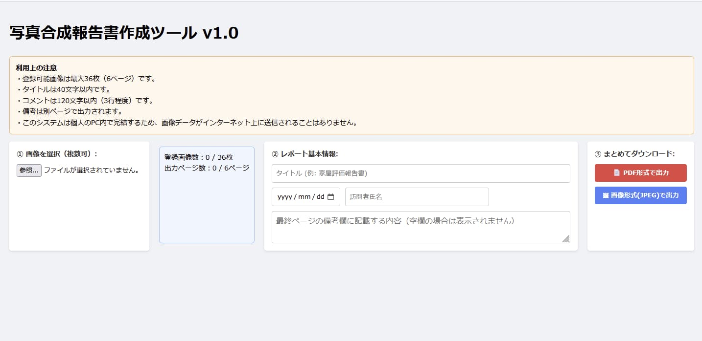
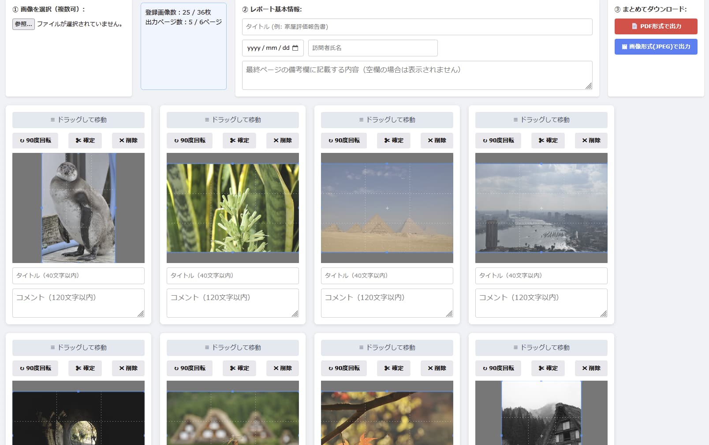
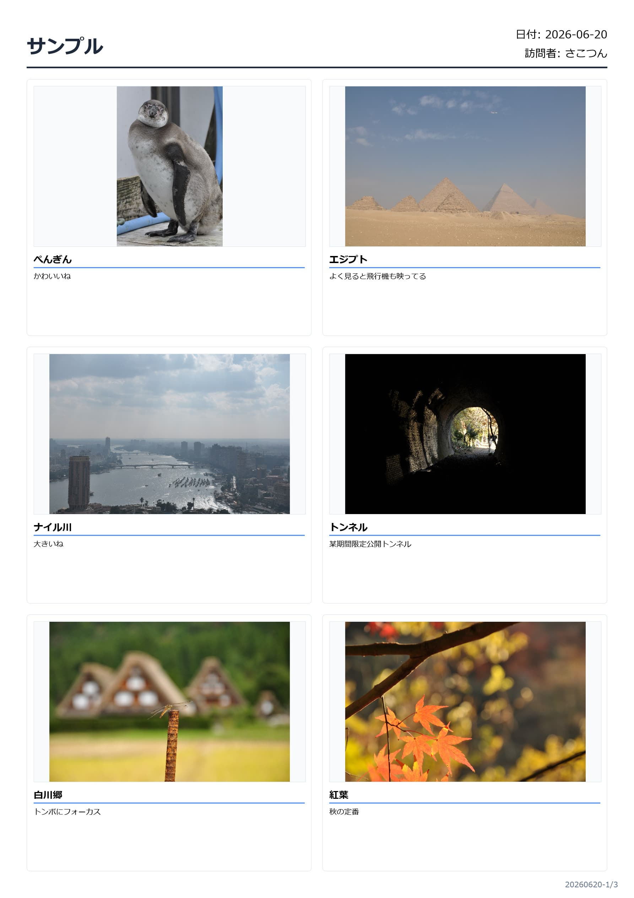

# 画像添付式報告書作成システム

https://sakotun.github.io/ho-mon-report-tool/

ブラウザだけで動作する画像付き報告書作成ツールです。

現地調査や家屋評価で撮影した写真を登録し、

- タイトル
- コメント
- 備考

を入力してPDFやJPEGとして出力できます。
利用想定は介護老人保健施設の自宅訪問に使えるのではと。  
ちまちまWordで作るの面倒じゃないですか？  
個人情報が厳しい世の中なので個人PCのメモリ内で動作します。  
よって画像データがインターネット上に送信されることなく、サーバーに保存もされません。  
画像出力モードで出した画像は電子カルテシステムにそのまま登録できるサイズだと思います。〇イズマンはできました。  
これで記録もばっちりだね！

---

## 主な機能

### 📷 写真登録

- 複数画像を一括登録
- 最大36枚まで登録可能

### ✂️ 写真トリミング

- Cropper.jsを利用
- 不要部分を除去可能

### 🔄 並び替え

- ドラッグ＆ドロップ対応
- SortableJSを利用

### 📝 タイトル入力

- 各写真ごとに入力可能
- 最大40文字

### 💬 コメント入力

- 各写真ごとに入力可能
- 最大120文字

### 📄 備考ページ

- 写真ページとは別ページとして出力
- 長文入力対応

### 📑 PDF出力

- A4レイアウトで出力

### 🖼 JPEG出力

- ページ単位でJPEG出力

### 🔢 ページ番号

以下の形式で自動付与

```
20260620-1/4
20260620-2/4
20260620-3/4
20260620-4/4
```

備考ページもページ数に含まれます。

### 📊 カウンター表示

画面上で現在の状態を確認できます。

```
登録画像数：18 / 36枚
出力ページ数：3 / 6ページ
```

---

## スクリーンショット

### メイン画面



### 編集画面



### 出力例



---

## レイアウト仕様

### 1ページあたり

- 2列 × 3行
- 最大6枚

```
┌──────────┬──────────┐
│ 写真1    │ 写真2    │
├──────────┼──────────┤
│ 写真3    │ 写真4    │
├──────────┼──────────┤
│ 写真5    │ 写真6    │
└──────────┴──────────┘
```

---

## 制限事項

| 項目 | 制限 |
|--------|--------|
| 写真枚数 | 最大36枚 |
| ページ数 | 最大6ページ |
| タイトル | 最大40文字 |
| コメント | 最大120文字 |

---

## 使用技術

- HTML
- CSS
- JavaScript

### ライブラリ

- Cropper.js
- SortableJS
- html2canvas
- jsPDF

---

## 開発中に苦労した点

### 画像の縦横比が崩れる

当初はタイルサイズへ強制的に合わせていたため、

- 人が横に伸びる
- 人が縦に潰れる

という問題が発生した。

#### 解決方法

```css
object-fit: contain;
```

を利用し、画像の縦横比を維持するよう修正した。

---

### 備考欄と写真が重なる

最終ページで

- 写真
- コメント
- 備考

が重なってしまう問題が発生。

#### 解決方法

備考を専用ページへ移動した。

---

### JPEG出力時に備考ページが出力されない

PDFでは正常に出力されるのに、

JPEGでは備考ページだけ出力されなかった。

#### 原因

```javascript
displayDate is not defined
```

というJavaScriptエラー。

#### 解決方法

変数スコープを見直し、

ループ外へ移動することで解決した。

---

### PDFが重い

PDFサイズは約1.6MBだったが、

Adobe Reader上でスクロールが若干カクつきました。

#### 原因

現在のPDFは

```
HTML
↓
html2canvas
↓
画像化
↓
PDF
```

という構造になっているため、

PDF内部は実質的に画像データとなっています。

ファイルサイズではなく、

PDFビューアの再描画負荷が原因だった。
意外とAdobe ReaderよりChoromeとかで見たほうがスムーズだった。

---

## 今後の実装案

- JPEG一括ZIP出力
- ロゴ挿入
- プロジェクト保存機能
- プロジェクト読込機能
- テンプレート機能
- PDF最適化

---


## バージョン

### v1.0

実運用開始版

機能一覧

- 写真登録
- トリミング
- 並び替え
- タイトル
- コメント
- 備考
- PDF出力
- JPEG出力
- ページ番号
- 枚数制限
- カウンター表示

---


## プロジェクト構成

```text
house-report/
├── LICENSE
├── index.html
├── style.css
├── script.js
├── README.md
└── img/
    ├── sample_main.png
    ├── sample_edit.png
    └── sample_output.png  
```

---


## ライセンス

MIT License

---

## 作者

さこつんワールド

GitHub:
https://github.com/sakotun

HP:
https://oi4832.party